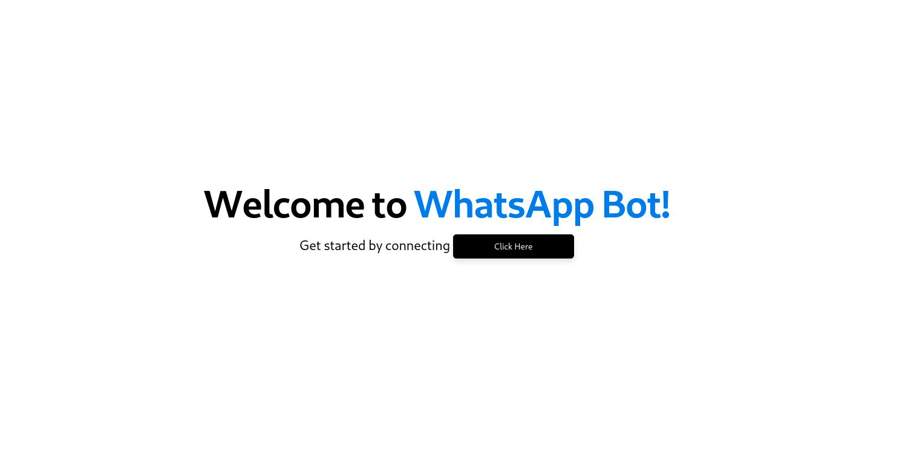
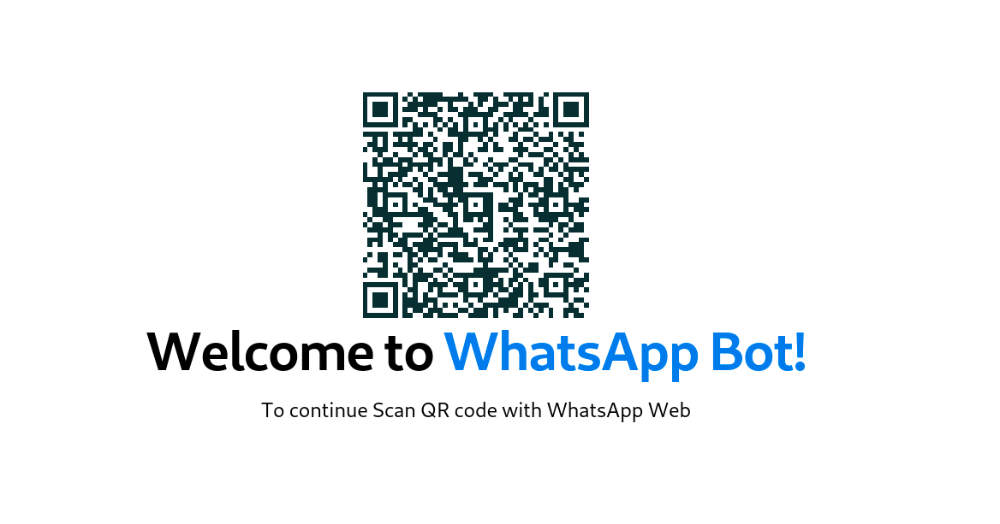
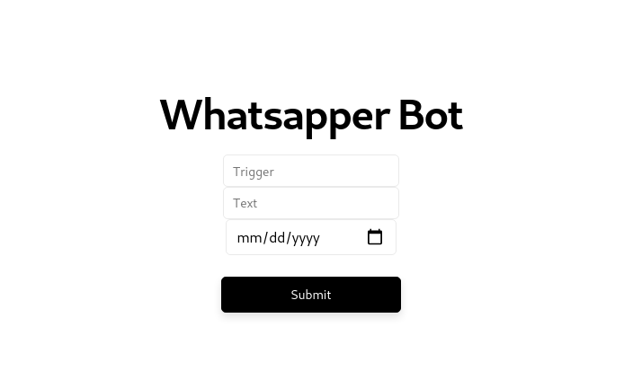

# WhatsApp Bot

    
   
   
  

  
    

> 👩🏽‍💻 Automate your whatsapp today

## Why WhatsApp Bot ?
Have you ever had to wake up early to send a messae to someone in whatsapp ? or maybe you want to automate replies to redundant messages, well whatsapp bot is here for you to make your life easier.

## How to use Whatsapp Bot

After downloading and running whatsapp bot
you shoud see the following screen.
The start button will appear which then you can click on to initate a connection with the backend server

After achieving a connection with the server if you have logged in before the server will automatically remember your token and log you in else it will show you a qr code to scan

## Adding custom messages

To add a custom message you can choose a message automation trigger which will send the desired message after someone sends you the trigger word and can set a time to send timed messages

## The future of Whatsapp bot

> Typescript support

> Docker Support

> & More

### For more information

* [Github](https://github.com/micaelillos)

* [Contact Me](https://micaelil.com/contact)

**Enjoy!**

